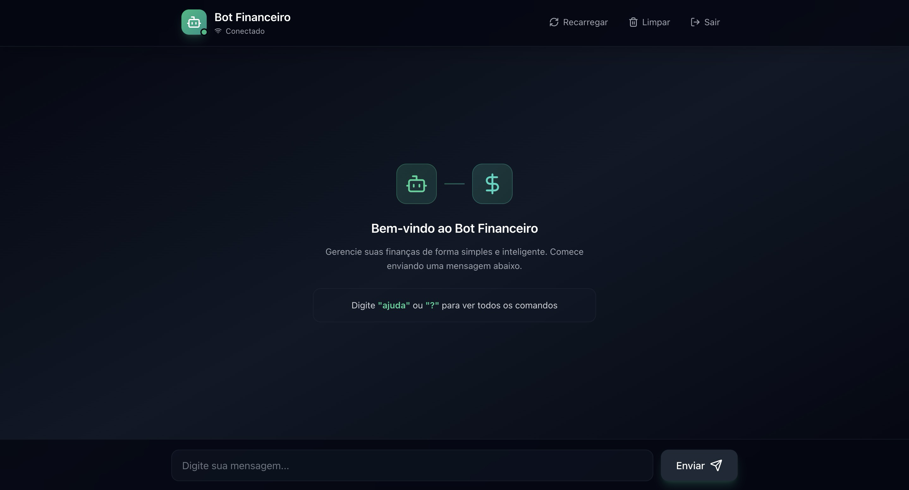
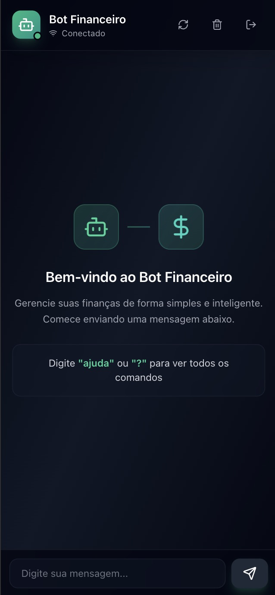

<div align="center">
  
  
  # 💬 Finance Chat Bot - Frontend
  
  ### *Your AI-Powered Personal Finance Assistant*
  
  > Manage your finances naturally through conversation. Track expenses, monitor income, and control budgets with an intelligent chatbot that syncs seamlessly with Google Sheets.
  
  [](https://finance-chat-bot-frontend.vercel.app)
  [](https://www.typescriptlang.org/)
  [](https://react.dev/)
  [](https://vitejs.dev/)
  [](https://socket.io/)
  
  ---
  
  > **⚠️ IMPORTANT NOTICE**  
  > This application is currently in **private beta** and is not yet available for public use. Access is restricted to authorized users only. If you're interested in using this application, please contact me in the connect section.
  
  ---
  
  ### 📸 Application Preview
  
  <table>
    <tr>
      <td align="center">
        
        <br>
        <em>Desktop Experience - Clean & Intuitive Chat Interface</em>
      </td>
      <td align="center">
        
        <br>
        <em>Mobile Experience - On-the-Go Finance Management</em>
      </td>
    </tr>
  </table>
  
</div>

## 🎯 About the Project

Finance Chat Bot Frontend is a cutting-edge web application that revolutionizes personal finance management through natural conversation. Built with modern web technologies, it offers an intuitive chat interface where users can effortlessly track expenses, log income, and manage budgets using plain language.

### The Story Behind This Project

This project was born from a personal need to keep a closer eye on my finances. I found myself struggling to maintain consistent tracking of expenses and income using traditional methods like spreadsheets or complex financial apps. I realized I needed something simpler, more intuitive, and conversational—a solution that would make financial management feel natural rather than like a chore. That's when I decided to build Finance Chat Bot: a way to manage finances through simple conversations, making it easier for anyone (including myself) to stay on top of their financial health.

### Why Finance Chat Bot?

- **💡 Natural Language Processing** - No complex forms or spreadsheet knowledge required
- **🔄 Real-Time Sync** - Instant data updates across all your devices
- **📊 Google Sheets Integration** - Your data, accessible anywhere you need it
- **🎯 Smart & Intuitive** - AI understands context and learns from your patterns
- **🔒 Secure & Private** - Your financial data stays protected

## ✨ Key Features

### 💬 Conversational Interface

- **Natural Language Processing** - Chat naturally about your finances
- **Real-Time Responses** - Instant feedback powered by WebSocket technology
- **Context-Aware** - Bot remembers your conversation history

### 📱 Cross-Platform Experience

- **Responsive Design** - Seamlessly adapts from mobile to desktop
- **Mobile-First Approach** - Optimized touch interactions and gestures
- **Pull-to-Refresh** - Intuitive mobile refresh functionality
- **Progressive Web App Ready** - Install on your home screen

### 🚀 Performance & Reliability

- **Lightning Fast** - Built with Vite for sub-second load times
- **Auto-Reconnection** - Intelligent WebSocket connection management
- **Offline-First** - Message persistence even when disconnected
- **Error Recovery** - Graceful handling of network issues

### 🎨 Modern User Experience

- **Clean UI** - Minimalist design focused on usability
- **Dark Mode Compatible** - Easy on the eyes (coming soon)
- **Accessible** - WCAG compliant interface
- **Smooth Animations** - Polished interactions and transitions

### 🔌 Integration & Data

- **Google Sheets Sync** - Direct integration with your financial spreadsheet
- **Real-Time Updates** - Changes reflect instantly across all platforms
- **Data Export** - Easy access to your financial history
- **Secure Communication** - Encrypted data transmission

---

## 🛠️ Technology Stack

### Core Technologies

| Technology                                    | Purpose      | Version | Why We Use It                                      |
| --------------------------------------------- | ------------ | ------- | -------------------------------------------------- |
| [React](https://react.dev/)                   | UI Framework | 19.2.0  | Component-based architecture for maintainable code |
| [TypeScript](https://www.typescriptlang.org/) | Type Safety  | 5.9.3   | Catch errors early, improve developer experience   |
| [Vite](https://vitejs.dev/)                   | Build Tool   | 7.2.4   | Lightning-fast HMR and optimized builds            |
| [Tailwind CSS](https://tailwindcss.com/)      | Styling      | 3.4.1   | Utility-first CSS for rapid UI development         |

### Libraries & Tools

| Technology                             | Purpose                 | Version |
| -------------------------------------- | ----------------------- | ------- |
| [Socket.IO Client](https://socket.io/) | Real-time Communication | 4.6.1   |
| [Lucide React](https://lucide.dev/)    | Icon Library            | 0.562.0 |
| [Zod](https://zod.dev/)                | Runtime Validation      | 4.2.1   |

### Development Tools

- **ESLint** - Code quality and consistency
- **PostCSS** - CSS processing and optimization
- **TypeScript ESLint** - TypeScript-specific linting rules

---

## 🚀 Quick Start

### Prerequisites

Before you begin, ensure you have the following installed:

- **Node.js** >= 18.x ([Download](https://nodejs.org/))
- **npm** >= 9.x (comes with Node.js)
- **Backend API** - Make sure the backend server is running

### Installation Steps

1. **Clone the Repository**

   ```bash
   git clone https://github.com/brenocrepaldi/finance-chat-bot-frontend.git
   cd finance-chat-bot-frontend
   ```

2. **Install Dependencies**

   ```bash
   npm install
   ```

   This will install all required packages defined in `package.json`.

3. **Configure Environment**

   Create a `.env` file in the root directory:

   ```bash
   cp .env.example .env
   ```

   Update `.env` with your backend URL:

   ```env
   VITE_SOCKET_URL=http://localhost:3000
   ```

4. **Start Development Server**

   ```bash
   npm run dev
   ```

   The application will start at [http://localhost:5173](http://localhost:5173)

5. **Verify Connection**
   - Open your browser to `http://localhost:5173`
   - Ensure the backend server is running
   - Start chatting with your finance bot!

### Troubleshooting

**Connection Issues?**

- Verify the backend server is running
- Check `VITE_SOCKET_URL` in your `.env` file
- Ensure no firewall is blocking port 3000

**Build Errors?**

- Clear node_modules: `rm -rf node_modules && npm install`
- Check Node.js version: `node --version`
- Update npm: `npm install -g npm@latest`

---

## ⚙️ Environment Configuration

### Environment Variables

Configure your application by setting the following environment variables in your `.env` file:

| Variable          | Description                  | Default                 | Required | Example                   |
| ----------------- | ---------------------------- | ----------------------- | -------- | ------------------------- |
| `VITE_SOCKET_URL` | Backend WebSocket server URL | `http://localhost:3000` | ✅ Yes   | `https://api.example.com` |

### Configuration Examples

**Local Development:**

```env
# Development environment
VITE_SOCKET_URL=http://localhost:3000
```

**Staging Environment:**

```env
# Staging environment
VITE_SOCKET_URL=https://staging-api.example.com
```

**Production:**

```env
# Production environment
VITE_SOCKET_URL=https://api.example.com
```

### Security Best Practices

- ✅ Never commit `.env` files to version control
- ✅ Use different configurations for each environment
- ✅ Store production secrets in your deployment platform's environment variables
- ✅ Use HTTPS URLs in production environments

---

## 📱 Mobile Access Guide

### Testing on Mobile Devices (Same Network)

To test your application on mobile devices while developing locally:

#### Step 1: Find Your Computer's IP Address

**macOS:**

```bash
ipconfig getifaddr en0
# Output example: 192.168.1.100
```

**Linux:**

```bash
hostname -I | awk '{print $1}'
# or
ifconfig | grep "inet " | grep -v 127.0.0.1
```

**Windows:**

```bash
ipconfig
# Look for IPv4 Address under your active network adapter
```

#### Step 2: Update Backend Configuration

Update your `.env` file with your computer's IP:

```env
VITE_SOCKET_URL=http://192.168.1.100:3000
```

_Replace `192.168.1.100` with your actual IP address_

#### Step 3: Restart Development Server

```bash
# Stop the current server (Ctrl+C)
npm run dev
```

#### Step 4: Access from Mobile

Open your mobile browser and navigate to:

```
http://192.168.1.100:5173
```

### Requirements & Troubleshooting

✅ **Requirements:**

- Both devices connected to the same WiFi network
- Firewall allows local network connections
- Backend server also accessible via local IP

⚠️ **Common Issues:**

| Issue                        | Solution                                                            |
| ---------------------------- | ------------------------------------------------------------------- |
| Cannot access from mobile    | Check firewall settings and ensure both devices are on same network |
| Connection refused           | Verify backend server is running and accessible                     |
| Page loads but no connection | Double-check `VITE_SOCKET_URL` points to backend IP                 |

### Installing as PWA (Progressive Web App)

1. Open the app in your mobile browser
2. Tap the browser menu (⋮ or ⋯)
3. Select "Add to Home Screen" or "Install App"
4. Access the app like a native application!

---

## 📂 Project Architecture

### Directory Structure

```
finance-chat-bot-frontend/
├── 📁 src/                      # Source code
│   ├── 📁 components/           # React components
│   │   ├── Chat.tsx            # Main chat container & logic
│   │   ├── Login.tsx           # Authentication component
│   │   ├── MessageBubble.tsx   # Message display component
│   │   └── Modal.tsx           # Reusable modal component
│   ├── 📁 services/            # External service integrations
│   │   └── socket.ts           # Socket.IO client singleton
│   ├── 📁 types/               # TypeScript definitions
│   │   └── index.ts            # Shared types & interfaces
│   ├── 📁 utils/               # Utility functions
│   │   ├── api.ts              # API helper functions
│   │   └── messageStorage.ts  # Local storage management
│   ├── 📁 assets/              # Static assets (images, fonts)
│   ├── App.tsx                 # Root component
│   ├── App.css                 # App-level styles
│   ├── main.tsx                # Application entry point
│   └── index.css               # Global styles + Tailwind
├── 📁 public/                   # Static files served as-is
│   ├── manifest.json           # PWA manifest
│   ├── bot.jpeg                # Bot logo
│   ├── chat.png                # Desktop screenshot
│   └── chat-mobile.png         # Mobile screenshot
├── 📄 .env.example              # Environment template
├── 📄 index.html                # HTML entry point
├── 📄 package.json              # Dependencies & scripts
├── 📄 tailwind.config.js        # Tailwind configuration
├── 📄 tsconfig.json             # TypeScript config (base)
├── 📄 tsconfig.app.json         # TypeScript config (app)
├── 📄 tsconfig.node.json        # TypeScript config (node)
└── 📄 vite.config.ts            # Vite build configuration
```

---

## 🏗️ Component Architecture

### Core Components

#### `Chat.tsx` - Main Chat Interface

**Purpose:** Orchestrates the entire chat experience

**Responsibilities:**

- ✅ Managing conversation state
- ✅ Handling WebSocket lifecycle (connect/disconnect/reconnect)
- ✅ Processing user input and bot responses
- ✅ Auto-scrolling to latest messages
- ✅ Error handling and connection status display

**Key Features:**

- Real-time message updates via Socket.IO
- Persistent message history (localStorage)
- Auto-reconnection on network issues
- Typing indicators (future enhancement)
- Message timestamps

#### `MessageBubble.tsx` - Message Display

**Purpose:** Reusable component for rendering individual messages

**Props:**

```typescript
interface MessageBubbleProps {
	message: string; // Message content
	timestamp: Date; // When message was sent
	isUser: boolean; // User vs Bot differentiation
}
```

**Features:**

- Dynamic styling based on sender (user/bot)
- Responsive layout for mobile/desktop
- Formatted timestamps (relative time)
- Markdown support (future enhancement)

#### `Login.tsx` - User Authentication

**Purpose:** Handles user authentication flow

**Features:**

- Simple authentication interface
- Session management
- Error handling for auth failures

#### `Modal.tsx` - Reusable Modal

**Purpose:** Generic modal component for dialogs

**Features:**

- Accessible keyboard navigation
- Click-outside-to-close
- Customizable content
- Animation transitions

### Services Layer

#### `socket.ts` - WebSocket Manager

**Purpose:** Singleton service for managing WebSocket connections

**Architecture Pattern:** Singleton

**Features:**

- ✅ Single connection instance across the app
- ✅ Automatic reconnection with exponential backoff
- ✅ Event listener management
- ✅ Connection status monitoring
- ✅ Error handling and recovery

**Events Handled:**

- `connect` - Successful connection established
- `disconnect` - Connection lost or closed
- `message` - Incoming message from bot
- `error` - Connection or message errors
- `reconnect` - Reconnection attempt successful

**Usage Example:**

```typescript
import socket from '@/services/socket';

// Listen for messages
socket.on('message', (data) => {
	console.log('Received:', data);
});

// Send message
socket.emit('message', { text: 'Hello!' });
```

### Utilities

#### `api.ts` - API Helpers

**Purpose:** HTTP request utilities and API endpoint management

**Functions:**

- Request/response interceptors
- Error handling standardization
- Authentication token management

#### `messageStorage.ts` - Local Storage

**Purpose:** Persist and retrieve chat history

**Functions:**

- Save messages to localStorage
- Retrieve conversation history
- Clear chat history
- Handle storage quotas

---

## 🎨 Design System

### Color Palette

| Element       | Color      | Hex       | Tailwind Class    |
| ------------- | ---------- | --------- | ----------------- |
| User Messages | Blue       | `#3B82F6` | `bg-blue-500`     |
| Bot Messages  | Light Gray | `#E5E7EB` | `bg-gray-200`     |
| Background    | Pale Gray  | `#F9FAFB` | `bg-gray-50`      |
| User Text     | White      | `#FFFFFF` | `text-white`      |
| Bot Text      | Dark Gray  | `#1F2937` | `text-gray-800`   |
| Accent        | Indigo     | `#6366F1` | `text-indigo-600` |

### Typography

- **Font Family:** System UI fonts for optimal performance
- **Headings:** Bold, larger sizes (text-xl, text-2xl)
- **Body:** Regular weight, 16px base size
- **Timestamps:** Smaller, lighter weight (text-xs, text-gray-500)

### Responsive Breakpoints

Following Tailwind CSS defaults:

| Breakpoint | Min Width | Target Devices              |
| ---------- | --------- | --------------------------- |
| `sm`       | 640px     | Large phones, small tablets |
| `md`       | 768px     | Tablets                     |
| `lg`       | 1024px    | Laptops, small desktops     |
| `xl`       | 1280px    | Large desktops              |
| `2xl`      | 1536px    | Extra large screens         |

### Spacing System

- **Base unit:** 0.25rem (4px)
- **Common spacing:** `space-y-4`, `p-6`, `m-4`
- **Container padding:** `px-4 md:px-6 lg:px-8`

---

## 💻 Development Guide

### Available Scripts

| Script          | Command              | Description                                          |
| --------------- | -------------------- | ---------------------------------------------------- |
| **Development** | `npm run dev`        | Start dev server with hot reload at `localhost:5173` |
| **Build**       | `npm run build`      | Create optimized production build in `dist/`         |
| **Preview**     | `npm run preview`    | Preview production build locally                     |
| **Lint**        | `npm run lint`       | Run ESLint for code quality checks                   |
| **Type Check**  | `npm run type-check` | Run TypeScript compiler without emitting files       |

### Development Workflow

Follow these best practices for contributing:

1. **Create a Feature Branch**

   ```bash
   git checkout -b feature/your-feature-name
   # or
   git checkout -b fix/bug-description
   ```

2. **Make Atomic Commits**

   ```bash
   git commit -m "feat: add message persistence"
   git commit -m "fix: resolve reconnection bug"
   ```

   Follow [Conventional Commits](https://www.conventionalcommits.org/):
   - `feat:` - New features
   - `fix:` - Bug fixes
   - `docs:` - Documentation changes
   - `style:` - Code style changes (formatting, etc.)
   - `refactor:` - Code refactoring
   - `test:` - Adding tests
   - `chore:` - Maintenance tasks

3. **Run Quality Checks**

   ```bash
   npm run lint          # Check code quality
   npm run type-check    # Verify TypeScript types
   npm run build         # Ensure build succeeds
   ```

4. **Test Thoroughly**
   - Test on multiple screen sizes (mobile, tablet, desktop)
   - Verify WebSocket connection/disconnection
   - Test error scenarios (backend down, network issues)
   - Check browser console for errors

5. **Preview Production Build**

   ```bash
   npm run build
   npm run preview
   ```

6. **Submit Pull Request**
   - Write a clear PR description
   - Reference any related issues
   - Add screenshots for UI changes
   - Request review from maintainers

### Code Style Guidelines

**TypeScript:**

- ✅ Use explicit types (avoid `any`)
- ✅ Prefer interfaces over types for object shapes
- ✅ Use optional chaining (`?.`) and nullish coalescing (`??`)
- ✅ Extract complex types into `src/types/`

**React:**

- ✅ Functional components with hooks
- ✅ Use `const` for components
- ✅ Extract reusable logic into custom hooks
- ✅ Keep components focused (single responsibility)

**CSS/Tailwind:**

- ✅ Use Tailwind utility classes primarily
- ✅ Extract repeated patterns into components
- ✅ Use responsive modifiers (`md:`, `lg:`)
- ✅ Maintain consistent spacing scale

**File Organization:**

- ✅ One component per file
- ✅ Co-locate related files
- ✅ Use clear, descriptive names
- ✅ Keep files under 300 lines when possible

### Recommended VS Code Extensions

- **ESLint** - Code quality
- **Prettier** - Code formatting
- **Tailwind CSS IntelliSense** - Tailwind autocomplete
- **TypeScript Error Translator** - Better TS error messages
- **Error Lens** - Inline error highlighting

### Debugging Tips

**WebSocket Issues:**

```typescript
// Add debug logging in socket.ts
socket.on('connect', () => {
	console.log('🟢 Connected:', socket.id);
});

socket.on('disconnect', (reason) => {
	console.log('🔴 Disconnected:', reason);
});
```

**State Debugging:**

```typescript
// Use React DevTools browser extension
// Add console.log strategically
useEffect(() => {
	console.log('Messages updated:', messages);
}, [messages]);
```

**Network Debugging:**

- Open browser DevTools (F12)
- Go to Network tab → WS (WebSocket)
- Monitor connection status and messages

---

## 🚀 Building & Deployment

### Build for Production

Create an optimized production build:

```bash
npm run build
```

**Build Output:**

- Production files are generated in `dist/` directory
- Assets are minified and optimized
- TypeScript is compiled to JavaScript
- CSS is purged of unused styles

**Build Performance:**

- ⚡ Vite's lightning-fast build times
- 🗜️ Automatic code splitting
- 🎯 Tree-shaking for minimal bundle size
- 📦 Asset optimization and compression

### Deployment Platforms

This application is ready to deploy on various platforms:

#### 🔷 Vercel (Recommended)

**Why Vercel?**

- Zero-config deployment
- Automatic HTTPS
- Global CDN
- Instant rollbacks
- Free tier available

**Deploy with Vercel CLI:**

```bash
# Install Vercel CLI
npm i -g vercel

# Deploy
vercel

# Deploy to production
vercel --prod
```

**Deploy via GitHub:**

1. Push your code to GitHub
2. Visit [vercel.com](https://vercel.com)
3. Import your repository
4. Configure environment variables
5. Deploy! 🚀

**Live Demo:** [https://finance-chat-bot-frontend.vercel.app](https://finance-chat-bot-frontend.vercel.app)

#### 🔶 Netlify

**Deploy with Netlify:**

```bash
# Install Netlify CLI
npm i -g netlify-cli

# Deploy
netlify deploy

# Deploy to production
netlify deploy --prod
```

**Build Settings:**

- Build command: `npm run build`
- Publish directory: `dist`

#### 📘 GitHub Pages

**Deploy to GitHub Pages:**

```bash
# Add to vite.config.ts
export default defineConfig({
  base: '/finance-chat-bot-frontend/',
  // ... rest of config
})

# Build
npm run build

# Deploy using gh-pages package
npm install -D gh-pages
npx gh-pages -d dist
```

#### ☁️ AWS S3 + CloudFront

**Deploy to AWS:**

```bash
# Build
npm run build

# Upload to S3
aws s3 sync dist/ s3://your-bucket-name --delete

# Invalidate CloudFront cache
aws cloudfront create-invalidation --distribution-id YOUR_ID --paths "/*"
```

### Environment Variables in Production

**Vercel:**

- Go to Project Settings → Environment Variables
- Add `VITE_SOCKET_URL` with your production backend URL
- Redeploy for changes to take effect

**Netlify:**

- Go to Site Settings → Build & Deploy → Environment
- Add `VITE_SOCKET_URL` variable
- Trigger a new deploy

**Important:** Always use HTTPS URLs in production!

### Post-Deployment Checklist

- ✅ Verify environment variables are set correctly
- ✅ Test WebSocket connection to backend
- ✅ Check browser console for errors
- ✅ Test on mobile devices
- ✅ Verify Google Sheets integration works
- ✅ Test error scenarios (network issues, etc.)
- ✅ Monitor application performance

### Performance Optimization

**Already Implemented:**

- Code splitting
- Tree shaking
- Minification
- Asset compression

**Future Improvements:**

- Service Worker for offline support
- Image lazy loading
- Route-based code splitting
- Caching strategies

## 📄 License

This project is licensed under the **MIT License** - see the [LICENSE](LICENSE) file for details.

---

## 🔗 Connect 

### Project Links

| Resource                   | Link                                                                                 |
| -------------------------- | ------------------------------------------------------------------------------------ |
| 🌐 **Live Demo**           | [finance-chat-bot-frontend.vercel.app](https://finance-chat-bot-frontend.vercel.app) |
| 📦 **Frontend Repository** | [GitHub - Frontend](https://github.com/brenocrepaldi/finance-chat-bot-frontend)      |
| 🔧 **Backend Repository**  | [GitHub - Backend](#)                                                                |

### Connect with the Author

**Breno Crepaldi**

[](https://github.com/brenocrepaldi)
[](https://linkedin.com/in/brenocrepaldi)
[](mailto:brenogaia2004@example.com)
[](https://brenocrepaldi.vercel.app)

### Support the Project

If you find this project helpful:

- ⭐ **Star the repository** on GitHub
- 🐛 **Report bugs** you encounter
- 💡 **Suggest features** you'd like to see
- 📖 **Improve documentation**
- 🔀 **Submit pull requests**
- 📢 **Share with others** who might benefit

### Acknowledgments

Special thanks to:

- **React Team** - For the amazing framework
- **Vite Team** - For lightning-fast tooling
- **Socket.IO Team** - For real-time communication
- **Tailwind CSS** - For utility-first CSS
- **Open Source Community** - For inspiration and support

---

<div align="center">
  
  ### ⭐ Star this repository if you find it helpful!
  
  **Made by [Breno Crepaldi](https://github.com/brenocrepaldi)**
  
  *Finance Chat Bot - Making personal finance management conversational and intuitive*
  
  ---
  
  **© 2026 Breno Crepaldi. All rights reserved.**
  
  [🔝 Back to Top](#finance-chat-bot---frontend)
  
</div>
